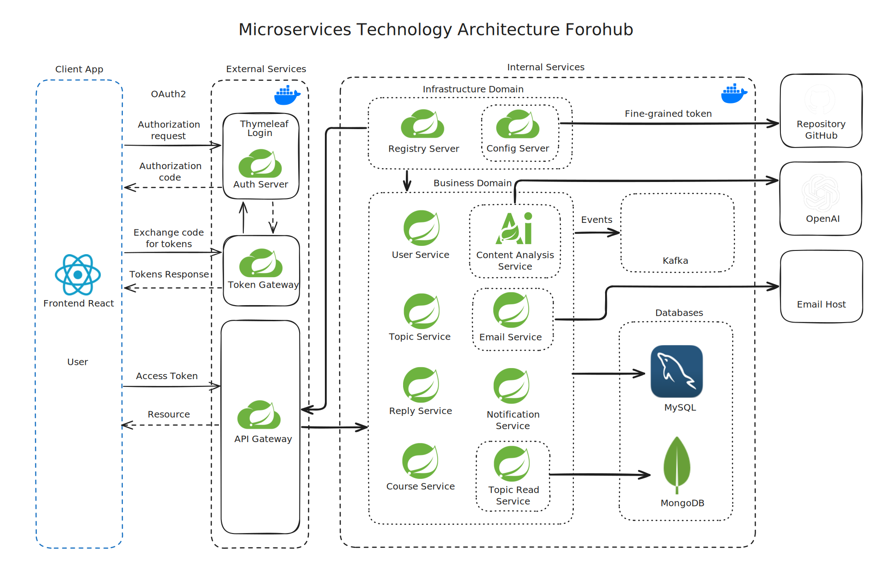
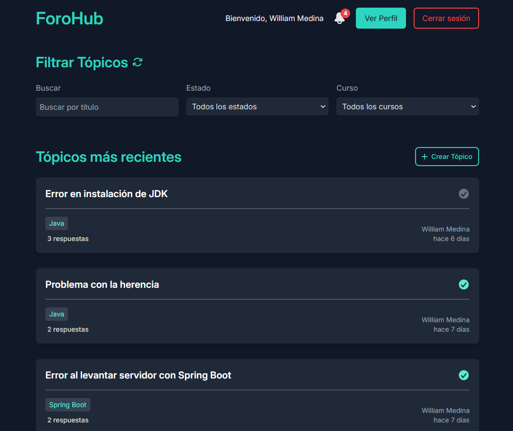
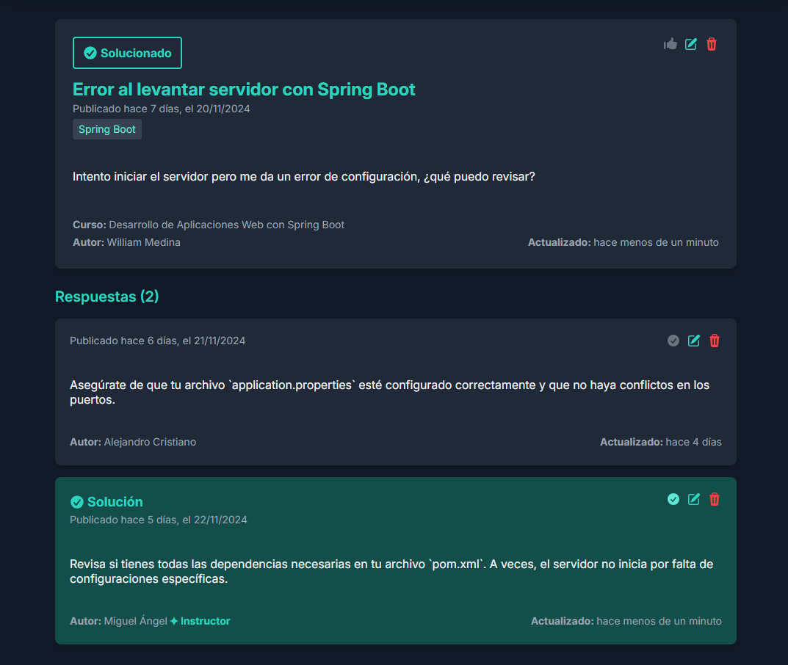
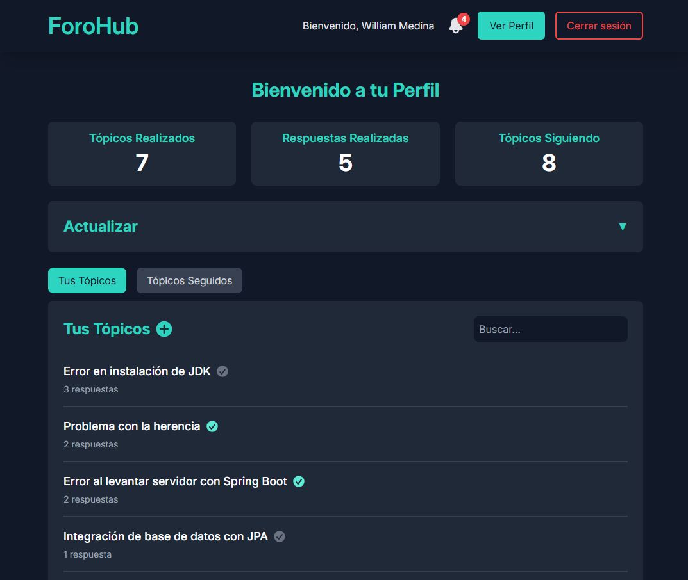
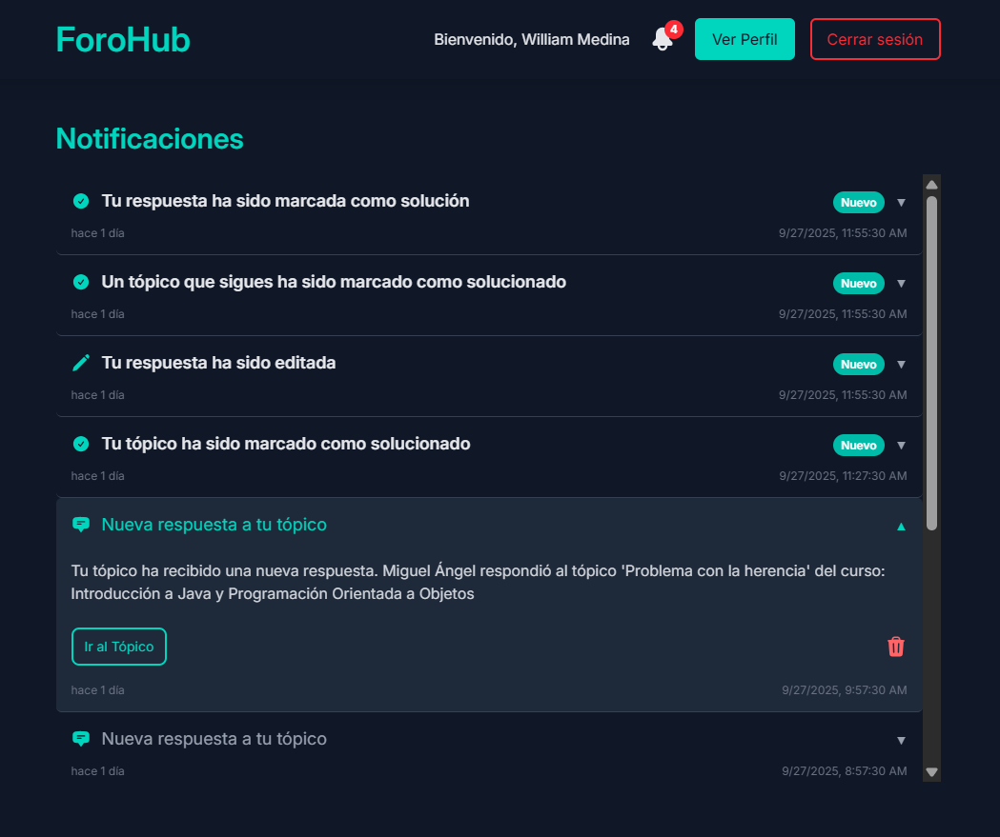

# 🌐 ForoHub  - Microservices


## 📑 Índice
1. [📝 Descripción](#-descripción)
2. [🏗️ Arquitectura General](#-arquitectura-general)
3. [📂 Repositorios y README de microservicios](#-repositorios-y-readme-de-microservicios)
4. [✨ Características principales](#-características-principales)
5. [💻 Tecnologías principales](#-tecnologías-principales)
6. [📦 Dependencias](#-dependencias)
7. [🔧 Requisitos del proyecto](#-requisitos-del-proyecto)
8. [📥 Instalación](#-instalación)
9. [🚀 Guía de Uso](#-guía-de-uso)
10. [🔗 Endpoints](#-endpoints)
     - [Endpoints de Usuario (`user-service`)](#endpoints-de-usuario-user-service)
     - [Endpoints de Tópicos (`topic-service`)](#endpoints-de-tópicos-topic-service)
     - [Endpoints de Respuestas (`reply-service`)](#endpoints-de-respuestas-reply-service)
     - [Endpoints de Notificaciones (`notification-service`)](#endpoints-de-notificaciones-notification-service)
     - [Endpoints de Cursos (`course-service`)](#endpoints-de-cursos-course-service)
     - [Endpoints de Tópico solo lectura (`topic-read-service`)](#endpoints-de-tópico-solo-lectura-topic-read-service)
     - [Endpoints de Token Gateway (`token-gateway`)](#endpoints-de-token-gateway-token-gateway)
     - [Endpoints de Análisis de Contenido (`content-analysis-service`)](#endpoints-de-análisis-de-contenido-content-analysis-service)
11. [🏛️ API Monolítica](#-api-monolítica)
12. [🎨 Frontend](#-frontend)
13. [📜 Licencia](#-licencia)
14. [👨‍💻 Autor](#-autor)

## 📝 Descripción

**ForoHub** es una plataforma de foros de discusión basada en cursos, desarrollada con **Spring Boot** y organizada como un conjunto de **microservicios** independientes. Cada microservicio gestiona un dominio específico, lo que permite una arquitectura más escalable, mantenible y resiliente.

Los usuarios pueden registrarse, autenticarse, crear tópicos asociados a cursos, responderlos, seguirlos y recibir notificaciones sobre eventos importantes. Los administradores, moderadores e instructores cuentan con permisos especiales para gestionar contenidos, incluyendo la edición o eliminación de tópicos y respuestas de otros usuarios.

El sistema utiliza un flujo de **eventos mediante Apache Kafka**, garantizando que las notificaciones, correos electrónicos y actualizaciones de lectura se procesen de manera confiable y sin duplicación. Además, incorpora **Inteligencia Artificial (IA)** para detectar contenido inapropiado en los tópicos y respuestas, asegurando un entorno seguro y adecuado para todos los usuarios.

Esta plataforma está diseñada para integrarse con un frontend en **React**, proporcionando una experiencia de usuario fluida y consistente.

## 🏗️ Arquitectura General

La arquitectura de **ForoHub API** está diseñada bajo un enfoque de **microservicios distribuidos**, organizada en dos dominios principales: **Business Domain** (lógica de negocio) y **Infrastructure Domain** (servicios de soporte).

Cada servicio se despliega de manera independiente, comunicándose entre sí mediante **REST APIs** o **Apache Kafka**, lo que garantiza **escalabilidad**, **resiliencia** y **desacoplamiento**. Solo algunos componentes están expuestos a internet, mientras que el resto permanece en una red interna segura.


### Diagrama de Arquitectura

  


### Business Domain — Lógica de Negocio

El **Business Domain** contiene los microservicios responsables de la lógica principal del sistema. Todos ellos se comunican a través del **API Gateway**, y algunos publican eventos en **Kafka** para procesos asíncronos.

- **user-service** → Maneja usuarios, perfiles, roles y relaciones básicas.
- **topic-service** → Gestiona la creación, edición y eliminación de tópicos.
- **reply-service** → Administra respuestas, validaciones y marcación de soluciones.
- **course-service** → Controla la información de los cursos disponibles.
- **notification-service** → Envía notificaciones internas en respuesta a eventos del sistema.
- **email-service** → Envía correos electrónicos automáticos en base a eventos publicados.
- **content-analysis-service** → Aplica inteligencia artificial para analizar el contenido publicado.
- **topic-read-service** → Ofrece consultas optimizadas y vistas agregadas desde MongoDB.


### Infrastructure Domain — Servicios de Soporte

El **Infrastructure Domain** agrupa los servicios encargados de la configuración, seguridad, descubrimiento y enrutamiento del sistema.

- **api-gateway** → Punto de entrada para todos los microservicios del Business Domain. Aplica filtros, autenticación y balanceo de carga.
- **auth-server** → Servidor OAuth2 responsable de la autenticación y emisión de tokens de acceso.
- **token-gateway** → Intermediario entre el frontend y el auth-server, encargado del intercambio y refresco de tokens.
- **config-server** → Centraliza la configuración de todos los microservicios a partir de un repositorio Git.
- **registry-server** → Gestiona el registro y descubrimiento dinámico de servicios dentro del ecosistema.

### Bases de Datos

El sistema utiliza dos tipos principales de almacenamiento:

- **MySQL** para los microservicios transaccionales (user, topic, reply, course, notification, email, auth).
- **MongoDB** para vistas optimizadas de lectura y agregación de datos (topic-read-service).

### Comunicación Asíncrona

La mensajería entre microservicios se maneja con **Apache Kafka**, permitiendo un flujo de eventos **asíncrono y desacoplado**. Los servicios `user-service`, `topic-service` y `reply-service` **publican eventos**, mientras que `email-service`, `notification-service` y `topic-read-service` **los consumen**, garantizando consistencia eventual y alta disponibilidad en el sistema.


### Inteligencia Artificial

El **content-analysis-service** utiliza modelos de **IA** para validar contenido generado por los usuarios, detectar lenguaje inapropiado y prevenir spam o publicaciones ofensivas.


### Seguridad y Exposición

- **Expuestos a Internet:** `api-gateway`, `auth-server`, `token-gateway`
- **Internos (Red Privada):** Todos los microservicios del *Business Domain* y los componentes de soporte.
- **Seguridad:** Basada en **OAuth2 + JWT**, con `access_token` manejado por el frontend y `refresh_token` seguro en cookie HTTP-only.


## 📂 Repositorios y README de microservicios
Cada microservicio de ForoHub tiene su propio repositorio y README detallado. Puedes acceder a ellos aquí:

- **[user-service](./business-domain/user-service/README.md)**: Gestión de usuarios, autenticación y roles.
- **[topic-service](./business-domain/topic-service/README.md)**: Creación, edición y eliminación de tópicos.
- **[reply-service](./business-domain/reply-service/README.md)**: Gestión de respuestas a los tópicos.
- **[course-service](./business-domain/course-service/README.md)**: Administración de cursos y su información.
- **[notification-service](./business-domain/notification-service/README.md)**: Gestión de notificaciones internas.
- **[email-service](./business-domain/email-service/README.md)**: Envío de correos electrónicos relacionados con eventos.
- **[content-analysis-service](./business-domain/content-analysis-service/README.md)**: Análisis de contenido mediante IA.
- **[topic-read-service](./business-domain/topic-read-service/README.md)**: Lecturas optimizadas de tópicos y respuestas en MongoDB.
- **[api-gateway](./infrastructure-domain/api-gateway/README.md)**: Puerta de entrada a los microservicios.
- **[auth-server](./infrastructure-domain/auth-server/README.md)**: Servidor OAuth2 para emisión de tokens.
- **[token-gateway](./infrastructure-domain/token-gateway/README.md)**: Intermediario seguro de tokens entre frontend y auth-server.
- **[config-server](./infrastructure-domain/config-server/README.md)**: Configuración centralizada de microservicios.
- **[registry-server](./infrastructure-domain/registry-server/README.md)**: Registro y descubrimiento de servicios (Eureka Server).

## ✨ Características principales

- **🔑 Registro y autenticación de usuarios**  
  Gestión completa de usuarios mediante OAuth2. `auth-server` y `token-gateway` se encargan de la emisión y validación de tokens, con `accessToken` almacenado en frontend y `refreshToken` en cookie HttpOnly.

- **📝 Gestión de tópicos (`topic-service`)**  
  Los usuarios pueden crear, editar y eliminar sus propios tópicos. Cada operación valida la existencia del usuario y del curso, analiza el contenido mediante `content-analysis-service` y, si es aprobado, almacena la información en MySQL y emite eventos a Kafka.

- **💬 Gestión de respuestas (`reply-service`)**  
  Los usuarios pueden responder a los tópicos y gestionar sus respuestas. Cada acción genera eventos que son procesados por `notification-service` y `email-service`, asegurando notificaciones consistentes y evitando duplicados.

- **🛠️ Actualización de perfil (`user-service`)**  
  Los usuarios autenticados pueden modificar su información personal, como nombre de usuario y contraseña. Los cambios relevantes generan eventos que actualizan la lectura optimizada en `topic-read-service`.

- **👀 Seguimiento de tópicos**  
  Los usuarios pueden seguir tópicos para recibir notificaciones sobre nuevas respuestas o cambios de estado, gestionadas mediante `notification-service` y enviadas por correo a través de `email-service`.

- **🔔 Notificaciones y correos electrónicos**  
  Todos los eventos relevantes (respuestas nuevas, tópicos resueltos, cambios de estado) se registran y procesan de manera confiable, evitando duplicación gracias al almacenamiento de eventos procesados.

- **🔍 Lectura optimizada (`topic-read-service`)**  
  Este servicio mantiene vistas rápidas de los tópicos y respuestas en **MongoDB**, permitiendo consultas eficientes.

- **👨‍💻 Roles y permisos especiales**  
  Moderadores, instructores y administradores pueden gestionar tópicos y respuestas de otros usuarios, así como marcar respuestas como solución de un tópico.

- **🤖 Análisis de contenido mediante IA (`content-analysis-service`)**  
  La Inteligencia Artificial analiza títulos y descripciones de tópicos y respuestas para garantizar que el contenido sea apropiado y seguro, mejorando la experiencia general del usuario.

## 💻 Tecnologías principales

- **Spring Boot**: Desarrollo ágil de microservicios en Java.
- **MySQL**: Base de datos para los microservicios transaccionales.
- **MongoDB**: Base de datos para lectura optimizada (`topicreadservice`).
- **OAuth2 y JWT**: Autenticación y autorización segura de usuarios.
- **API REST & Feign Clients**: Comunicación entre microservicios.
- **Spring WebFlux**: Para flujos reactivos, como el análisis de contenido.
- **Apache Kafka**: Emisión y consumo de eventos entre microservicios.
- **Springdoc OpenAPI / Swagger UI**: Documentación y prueba interactiva de endpoints.
- **Spring AI**: Integración de IA para análisis de contenido.

## 📦 Dependencias

ForoHub está construido sobre una arquitectura de **microservicios**. A continuación se listan todas las principales dependencias utilizadas en los distintos servicios del proyecto:

- **Spring Boot**: Framework principal para el desarrollo de microservicios en Java.
- **Spring Data JPA**: Facilita la persistencia de datos en bases de datos relacionales (MySQL).
- **Spring Boot Starter Web / WebFlux**: Para exponer APIs REST y flujos reactivos.
- **Spring Boot Starter Validation**: Validación de objetos y parámetros de entrada.
- **Flyway**: Migraciones y versionamiento de bases de datos.
- **MySQL Connector**: Conector JDBC para interactuar con MySQL.
- **Lombok**: Reduce código repetitivo con anotaciones (getters, setters, constructores).
- **SpringDoc OpenAPI / Swagger UI**: Documentación automática de la API.
- **Apache Kafka (Spring Cloud Stream Kafka)**: Comunicación basada en eventos entre microservicios.
- **Spring Cloud Netflix Eureka**: Registro y descubrimiento de microservicios.
- **Spring Cloud Config**: Configuración centralizada para los microservicios.
- **Spring Cloud OpenFeign**: Clientes HTTP declarativos para comunicación entre microservicios.
- **Spring Boot Starter Mail**: Envío de correos electrónicos desde `email-service`.
- **Spring AI**: Integración de Inteligencia Artificial para análisis de contenido (`content-analysis-service`).
- **Spring Boot Starter Actuator**: Monitorización y métricas de los microservicios.
- **Spring Boot Starter Thymeleaf**: Renderizado de plantillas para login y UI integrada (`auth-server`).
- **Spring Boot Starter OAuth2 Authorization Server**: Servidor OAuth2 para emisión de tokens (`auth-server`).
- **Spring Boot Starter OAuth2 Resource Server**: Validación de tokens en solicitudes al API Gateway.
- **Spring Boot Starter Data MongoDB**: Almacenamiento y consultas rápidas en MongoDB (`topic-read-service`).
- **Spring Cloud Starter Gateway**: API Gateway para enrutamiento, filtrado y seguridad de solicitudes.
- **Spring Cloud Starter Netflix Eureka Server**: Registro de servicios (`registry-server`).
- **Spring Cloud Config Server**: Configuración centralizada (`config-server`).
- **spring-ai-starter-model-openai**: Integración de modelos OpenAI para análisis de contenido (`content-analysis-service`).

## 🔧 Requisitos del proyecto

- **JDK 21** o superior.
- **Maven** para la gestión de dependencias.
- **MySQL** para los microservicios transaccionales.
- **MongoDB** para `topic-read-service`.
- **Kafka** para la mensajería basada en eventos.
- **Servidor de correo electrónico** para notificaciones (`email-service`).
- **Credenciales de IA** (OpenAI) para el análisis de contenido.
- **Docker** y **Docker Compose** para levantar contenedores de microservicios, bases de datos y Kafka.
- **IntelliJ IDEA** o cualquier IDE compatible con Java.


## 📥 Instalación

1. **Clona el repositorio**:
    ```bash
    git clone https://github.com/william-medina/forohub-microservices.git
    ```

2. **Accede al directorio del proyecto**:
    ```bash
    cd forohub-microservices
    ```

3. **Agrega las variables de entorno**:  
  A continuación, agrega las siguientes variables de entorno directamente en la configuración de tu sistema operativo o IDE.

    ```dotenv
    # 📊 Base de Datos MySQL
    MYSQL_HOST=your_mysql_host
    MYSQL_PORT=your_mysql_port
    MYSQL_ROOT_PASSWORD=your_root_mysql_password
    MYSQL_TOPIC_SERVICE=your_topic_username
    MYSQL_TOPIC_PASSWORD=your_topic_password
    MYSQL_USER_SERVICE=your_user_username
    MYSQL_USER_PASSWORD=your_user_password
    MYSQL_REPLY_SERVICE=your_reply_username
    MYSQL_REPLY_PASSWORD=your_reply_password
    MYSQL_COURSE_SERVICE=your_course_username
    MYSQL_COURSE_PASSWORD=your_course_password
    MYSQL_NOTIFICATION_SERVICE=your_notification_username
    MYSQL_NOTIFICATION_PASSWORD=your_notification_password
    MYSQL_EMAIL_SERVICE=your_email_username
    MYSQL_EMAIL_PASSWORD=your_email_password
    MYSQL_AUTH_SERVER=your_auth_server_username
    MYSQL_AUTH_PASSWORD=your_auth_server_password
      
    # 📊 Base de Datos MongoDB
    MONGO_ROOT_USER=your_root_username
    MONGO_ROOT_PASSWORD=your_root_password
    MONGO_TOPIC_READ_SERVICE=your_topic_read_username
    MONGO_TOPIC_READ_PASSWORD=your_topic_read_password 
    
    # 📧 Servidor de Email
    EMAIL_ENABLED=true/false
    EMAIL_FROM=your_email_from
    EMAIL_HOST=your_email_host
    EMAIL_PORT=your_email_port
    EMAIL_USER=your_email_user
    EMAIL_PASS=your_email_password
    
    # 🌍 Frontend y OAuth2
    FRONTEND_URL=http://localhost:5173
    AUTH_CLIENT_ID=your_client_id
    AUTH_CLIENT_SECRET=your_client_secret
    AUTH_REDIRECT_URI=your_frontend_oauth_callback
    AUTH_SERVER_ISSUER_URI=http://localhost:9000
    
    # 🤖 Inteligencia Artificial
    AI_API_KEY=your_ai_api_key
    AI_ENABLED=true/false
    
    # 🏗️ Infraestructura y servicios
    CONFIG_SERVER_HOST=your_config_server_url
    EUREKA_URL=your_eureka_server_url
    KAFKA_SERVERS=your_kafka_bootstrap_servers
    SPRING_PROFILES_ACTIVE=default
    
    # 💻 Repositorio de configuración
    GIT_URI=your_git_config_repo
    GIT_USERNAME=your_git_username
    GIT_TOKEN=your_git_token
    ```
    Reemplaza los valores de ejemplo con los detalles de tu configuración real.

4. **Compila los microservicios antes de construir los contenedores**

   Cada microservicio debe generar su archivo `.jar` antes de ser empaquetado por Docker.  
   Desde la **raíz de cada servicio**, ejecuta:

    ```bash
    mvn clean install -DskipTests
    ```

   Ejemplo de rutas:
    ```
    business-domain/user-service
    business-domain/topic-service
    business-domain/reply-service
    business-domain/course-service
    business-domain/notification-service
    business-domain/email-service
    business-domain/content-analysis-service
    business-domain/topic-read-service
    infrastructure-domain/auth-server
    infrastructure-domain/token-gateway
    infrastructure-domain/api-gateway
    infrastructure-domain/config-server
    infrastructure-domain/registry-server
   ```

   > 💡 Este paso es **obligatorio** antes del `docker-compose up`, ya que los Dockerfiles esperan encontrar los JARs generados en el target correspondiente.
   
5. **Inicializa las bases de datos en los contenedores**:

    Los contenedores de **MySQL** y **MongoDB** ejecutan scripts automáticos al iniciarse para crear usuarios, bases de datos y permisos.
    
    Rutas de los scripts de inicialización:
    - **MySQL:** `docker/mysql/init-mysql.sh`
    - **MongoDB:** `docker/mongo/init-mongo.sh`
   
6. **Levanta los contenedores con Docker Compose**

   Una vez que los `.jar` están generados y las variables configuradas, ejecuta desde la raíz del proyecto:

    ```bash
    docker-compose up -d
   ```
    > 🔹 **Nota:** Durante el primer arranque, los contenedores de **MySQL** y **MongoDB** ejecutarán automáticamente los scripts de inicialización (`init-mysql.sh` y `init-mongo.sh`), creando las bases de datos y usuarios necesarios para que los microservicios funcionen correctamente.

## 🚀 Guía de Uso

### Opciones de Ejecución

El ecosistema **ForoHub Microservices** puede ejecutarse de dos formas distintas, según tus necesidades y recursos:

#### 🔹 **Opción 1: Todo el entorno en Docker**
Ejecuta **todos los microservicios y componentes** dentro de contenedores Docker.  
Esta opción es ideal para entornos de **producción o pruebas integrales**, ya que reproduce completamente la arquitectura distribuida.

```bash
docker compose up -d
```
> ✅ **Ventaja:** No necesitas abrir ningún proyecto en el IDE, todo se ejecuta en segundo plano.
>
> ⚠️ **Requisito:** Debes haber compilado previamente los `.jar` de cada microservicio (`mvn clean install -DskipTests`).


#### 🔹 **Opción 2: Solo bases de datos y mensajería en Docker**
Ejecuta únicamente los servicios esenciales en contenedores, y el resto de los microservicios desde tu **IDE (IntelliJ IDEA o Eclipse)**.

**Contenedores mínimos obligatorios:**
- **MySQL**
- **MongoDB**
- **Kafka**

Ejemplo de comando:
```bash
docker compose up -d mysql mongodb kafka
```

Luego, abre en tu IDE los microservicios que deseas probar y ejecuta la clase Main o Application correspondiente de cada uno

> 💡 Esta opción es ideal para desarrollo local, ya que puedes depurar, modificar y reiniciar servicios sin reconstruir los contenedores.

### Documentación de la API

Cada microservicio expone su documentación mediante **Swagger UI**, accesible desde el navegador una vez que el servicio esté en ejecución.

```
http://localhost:{puerto}/swagger-ui/index.html
```

> 💡 **Swagger** permite explorar y probar los endpoints directamente desde el navegador.

### Colección para Postman
- Para realizar pruebas rápidas de los endpoints disponibles, el proyecto incluye una colección de **Postman** preconfigurada.
- Importa el archivo `ForoHub.postman_collection.json` desde la carpeta `docs/postman` en Postman utilizando la opción "Importar". Una vez importado, podrás comenzar a interactuar con la API de forma inmediata.

  ```
  docs/postman/ForoHub.postman_collection.json
  ```

## 🔗 Endpoints
A continuación, se presenta la lista completa de endpoints disponibles de todos los microservicios.

### Endpoints de Usuario (`user-service`)
Estos endpoints permiten gestionar las cuentas de usuario, desde la creación hasta la actualización de password y nombres de usuario, así como la obtención de detalles y estadísticas del usuario autenticado.

| Endpoint                        | Método      | Descripción                                                                                                                |
|---------------------------------|-------------|----------------------------------------------------------------------------------------------------------------------------|
| `/api/auth/create-account`      | `POST`      | Crea una cuenta de usuario en el sistema.                                                                                  |
| `/api/auth/confirm-account/{token}` | `GET`       | Confirma la cuenta de usuario utilizando un token proporcionado.                                                           |
| `/api/auth/request-code`            | `POST`      | Solicita un nuevo código de confirmación y lo envía al email del usuario.                                                  |
| `/api/auth/forgot-password`         | `POST`      | Genera un token de restablecimiento de contraseña y lo envía al email del usuario.                                         |
| `/api/auth/update-password/{token}` | `POST`      | Permite actualizar la contraseña utilizando un token de restablecimiento.                                                  |
| `/api/auth/update-password`         | `PATCH`     | Permite al usuario autenticado actualizar su contraseña actual.                                                            |
| `/api/auth/update-username`         | `PATCH`     | Permite al usuario autenticado actualizar su nombre de usuario.                                                            |
| `/api/auth/stats`                   | `GET`       | Obtiene estadísticas del usuario autenticado.                                                                              |
| `/api/auth/me`                      | `GET`       | Obtiene los detalles del usuario actualmente autenticado.                                                                  |
---

### Endpoints de Tópicos (`topic-service`)
Estos endpoints gestionan la creación, actualización y eliminación de tópicos, así como el seguimiento de los mismos por parte de los usuarios. La eliminación de un tópico es lógica, es decir, no se elimina físicamente de la base de datos, sino que se marca como eliminado.

| Endpoint                                      | Método      | Descripción                                                                                             |
|-----------------------------------------------|-------------|---------------------------------------------------------------------------------------------------------|
| `/api/topic`                                      | `POST`      | Crea un nuevo tópico con los datos proporcionados.                                                      |
| `/api/topic/{topicId}`                            | `PUT`       | Actualiza los detalles de un tópico existente. Si el tópico es editado por un moderador, instructor o administrador, el creador recibirá una notificación y un email.|
| `/api/topic/{topicId}`                            | `DELETE`    | Elimina un tópico de manera lógica. El creador recibirá una notificación y un email si el tópico es eliminado por un moderador, instructor o administrador.                                                            |
| `/api/topic/follow/{topicId}`                     | `POST`      | Permite a un usuario seguir o dejar de seguir un tópico específico.                                     |
---

### Endpoints de Respuestas (`reply-service`)
Los endpoints de respuestas gestionan la creación, actualización, eliminación y la posibilidad de marcar una respuesta como solución. Al igual que los tópicos, la eliminación de respuestas es lógica.

| Endpoint              | Método      | Descripción                                                                                                                                                                                                                                                                                             |
|-----------------------|-------------|---------------------------------------------------------------------------------------------------------------------------------------------------------------------------------------------------------------------------------------------------------------------------------------------------------|
| `/api/reply`              | `POST`      | Crea una respuesta para un tópico. Si se agrega una respuesta, el creador del tópico y los usuarios que lo siguen recibirán notificaciones y emails informándoles.                                                                                                                                      |
| `/api/reply/user/replies` | `GET`       | Obtiene todas las respuestas del usuario autenticado con paginación.                                                                                                                                                                                                                                    |
| `/api/reply/{replyId}`    | `GET`       | Obtiene una respuesta específica utilizando su ID.                                                                                                                                                                                                                                                      |
| `/api/reply/{replyId}` | `PUT`       | Actualiza una respuesta. Si la actualización la hace un moderador, instructor o administrador, solo se notifica al creador de la respuesta.                                                                                                                                                             |
| `/api/reply/{replyId}` | `PATCH`     | Alterna el estado de una respuesta como solución o la quita si ya estaba marcada como solución. Además, actualiza el estado del tópico, indicándole si está activo o cerrado. Al hacerlo, Se notificará al creador de la respuesta, al creador del tópico, y a todos los usuarios que siguen el tópico. |
| `/api/reply/{replyId}` | `DELETE`    | Elimina una respuesta de manera lógica. Si un moderador, instructor o administrador la elimina, solo se notifica al creador de la respuesta.                                                                                                                                                            |
---

### Endpoints de Notificaciones (`notification-service`)
Estos endpoints gestionan las notificaciones del usuario, permitiendo obtenerlas, eliminarlas o marcarlas como leídas.

| Endpoint                             | Método       | Descripción                                                                                                      |
|--------------------------------------|--------------|------------------------------------------------------------------------------------------------------------------|
| `/api/notify`                            | `GET`        | Obtiene todas las notificaciones del usuario autenticado, ordenadas por fecha de creación.                       |
| `/api/notify/{notifyId}`                 | `DELETE`     | Elimina una notificación específica por su ID, si pertenece al usuario autenticado.                             |
| `/api/notify/{notifyId}`                 | `PATCH`      | Marca como leída una notificación específica por su ID, si pertenece al usuario autenticado.                    |
---

### Endpoints de Cursos (`course-service`)
Este endpoint permite obtener información sobre los cursos disponibles en la API.

| Endpoint            | Método   | Descripción                                                                                 |
|---------------------|----------|---------------------------------------------------------------------------------------------|
| `/api/course`           | `GET`    | Recupera todos los cursos disponibles en la API, ordenados alfabéticamente por su nombre.  |

### Endpoints de Tópico solo lectura (`topic-read-service`)
Estos endpoints permiten obtener la información de los tópicos creados y seguidos por los usuarios, con soporte de paginación y filtrado opcional.

| Endpoint                       | Método | Descripción                                                                                          |
|--------------------------------|--------|------------------------------------------------------------------------------------------------------|
| `/api/topic`                        | `GET`  | Obtiene todos los tópicos con paginación y filtrado opcional por curso, palabra clave y estado.      |
| `/api/topic/user/topics`            | `GET`  | Obtiene los tópicos creados por el usuario con paginación y filtrado opcional por palabra clave.     |
| `/api/topic/{topicId}`              | `GET`  | Obtiene un tópico específico por su ID, incluyendo todas sus respuestas.                             |
| `/api/topic/user/followed-topics`  | `GET`   | Obtiene los tópicos seguidos por el usuario con paginación y filtrado opcional por palabra clave.    |

### Endpoints de Token Gateway (`token-gateway`)
Estos endpoints permiten gestionar el intercambio de tokens entre el frontend y el Auth Server, así como refrescar el access_token y cerrar sesión eliminando el refresh_token almacenado en cookie HTTP-only.

| Endpoint             | Método | Descripción                                                                                      |
|----------------------|--------|--------------------------------------------------------------------------------------------------|
| `/token/exchange`    | `POST` | Intercambia el `authorization_code` del frontend por `access_token` y almacena `refresh_token` en cookie HTTP-only. |
| `/token/refresh`     | `POST`   | Usa el `refresh_token` almacenado en cookie para obtener un nuevo `access_token`.               |
| `/token/logout`      | `POST`   | Cierra sesión eliminando la cookie que contiene el `refresh_token`.                              |


### Endpoints de Análisis de Contenido (`content-analysis-service`)
Estos endpoints permiten validar contenido de texto y nombres de usuario mediante IA, identificando contenido inapropiado, spam, ofensivo o irrelevante.


| Endpoint                 | Método | Descripción                                                                                      |
|--------------------------|--------|--------------------------------------------------------------------------------------------------|
| `/validation/content`    | `POST`   | Valida un texto (título o descripción de tópico) para determinar si contiene contenido inapropiado, spam, ofensivo o irrelevante. |
| `/validation/username`   | `POST`   | Valida un nombre de usuario para detectar contenido inapropiado, ofensivo, spam o nombres sin sentido. |


## 🏛️ API Monolítica

**ForoHub** cuenta con una versión **monolítica** de la API, que combina toda la funcionalidad de los microservicios en un solo proyecto. Esta versión puede ser útil para desarrollo local, pruebas rápidas o entornos donde no se desea desplegar múltiples microservicios.

### Acceso al Repositorio
El código fuente de la API monolítica está disponible en el siguiente enlace:

👉 [Repositorio de la API Monolítica en GitHub](https://github.com/william-medina/forohub-api)


## 🎨 Frontend
La API cuenta con un frontend desarrollado en **React** utilizando **TypeScript** y **Tailwind CSS**. Este frontend está diseñado para interactuar de manera efectiva con la API.

### Acceso al Repositorio
El código fuente está disponible en el siguiente enlace:

👉 [Repositorio del Frontend en GitHub](https://github.com/william-medina/forohub-app)

### Ver el Proyecto en Producción
Puedes ver la aplicación en producción solo conectada con la api monolítica, en el siguiente enlace:

🌐 [Ver Proyecto en Producción](https://forohub.william-medina.com)

> **⚠️ Importante**: Si la API ha estado inactiva durante un tiempo, es posible que necesites esperar unos instantes para que el servidor se inicie. Este proceso podría tardar algunos minutos.

### Características Destacadas del Frontend
- **📱 Interfaz Responsiva**: Diseñada para ofrecer una experiencia de usuario fluida en dispositivos móviles y de escritorio.
- **🔗 Conexión Eficiente a la API**: Conexión en tiempo real con la API REST para garantizar una comunicación fluida y la actualización dinámica de los datos mostrados en la interfaz.
- **🔄 Componentes Reutilizables**: Estructura modular que simplifica el mantenimiento y la escalabilidad de la aplicación.

### Imágenes del Frontend


A continuación, se presentan algunas capturas de pantalla del frontend de algunas paginas:

#### Página de Inicio:


#### Detalles de los Tópicos:


#### Página de Perfil:


#### Notificaciones:


## 📜 Licencia

Este proyecto está bajo la Licencia MIT. Para más detalles, consulta el archivo [LICENSE](./LICENSE).

## 👨‍💻 Autor

**William Medina**  
Autor y desarrollador de **ForoHub - Microservices**. Puedes encontrarme en [GitHub](https://github.com/william-medina)


