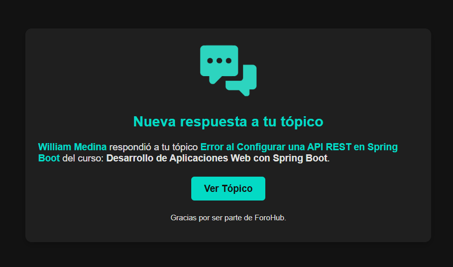
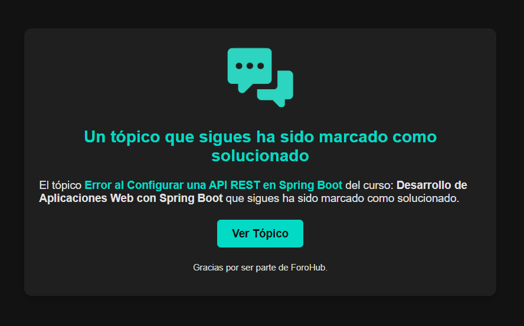

# 🌐 ForoHub - [Email Service]


## 📚 Índice

1. [📝 Descripción](#-descripción)
2. [✨ Características principales](#-características-principales)
3. [💻 Tecnologías principales](#-tecnologías-principales)
4. [📦 Dependencias](#-dependencias)
5. [🔧 Requisitos del proyecto](#-requisitos-del-proyecto)
6. [🧩 Variables de Entorno](#-variables-de-entorno)
7. [🧱 Arquitectura y Comunicación](#-arquitectura-y-comunicación)
8. [🗄️ Base de Datos](#-base-de-datos)
9. [👨‍💻 Autor](#-autor)

---

## 📝 Descripción

El **Email Service** es el microservicio encargado de **enviar correos electrónicos automáticos** dentro de la plataforma **ForoHub**.

Procesa los **eventos del ecosistema** (usuarios, tópicos y respuestas) mediante **Spring Cloud Stream** y **Apache Kafka**, generando notificaciones por correo según la actividad de los usuarios.

Su diseño está completamente **desacoplado**, manteniendo una **copia local de contactos de usuario** en la tabla `user_contacts`, lo que le permite operar sin depender directamente de `user-service`.


## ✨ Características principales

- 📬 **Envío de correos automáticos:** Notificaciones por correo ante nuevos tópicos, respuestas, cuentas creadas o solicitudes de restablecimiento.
- 🔄 **Consumo de eventos Kafka por Stream:** Escucha los tópicos `user-events`, `topic-events` y `reply-events`.
- 🧱 **Desacoplamiento total:** Mantiene una réplica mínima de usuarios (`user_contacts`) con información esencial.
- 📨 **Correos de verificación y recuperación:** Envía emails de confirmación de cuenta y restablecimiento de contraseña.
- ⚙️ **Procesamiento idempotente:** Utiliza una tabla `processed_events` para evitar procesar el mismo evento más de una vez.


## 💻 Tecnologías principales

- **Spring Boot**: Desarrollo ágil de microservicios en Java.
- **MySQL**: Base de datos para los microservicios transaccionales.
- **Apache Kafka**: Emisión y consumo de eventos entre microservicios.

## 📦 Dependencias

ForoHub está construido sobre una arquitectura de **microservicios**. A continuación se listan todas las principales dependencias utilizadas en los distintos servicios del proyecto:

- **Spring Boot**: Framework principal para el desarrollo de microservicios en Java.
- **Spring Data JPA**: Facilita la persistencia de datos en bases de datos relacionales (MySQL).
- **Flyway**: Migraciones y versionamiento de bases de datos.
- **MySQL Connector**: Conector JDBC para interactuar con MySQL.
- **Lombok**: Reduce código repetitivo con anotaciones (getters, setters, constructores).
- **Apache Kafka (Spring Cloud Stream Kafka)**: Comunicación basada en eventos entre microservicios.
- **Spring Cloud Netflix Eureka**: Registro y descubrimiento de microservicios.
- **Spring Cloud Config**: Configuración centralizada para los microservicios.
- **Spring Boot Starter Mail**: Envío de correos electrónicos desde `email-service`.
- **Spring Boot Starter Actuator**: Monitorización y métricas de los microservicios.

## 🔧 Requisitos del proyecto

- **JDK 21** o superior.
- **Maven** para la gestión de dependencias.
- **MySQL** para los microservicios transaccionales.
- **Kafka** para la mensajería basada en eventos.
- **Servidor de correo electrónico** para notificaciones (`email-service`).
- **IntelliJ IDEA** o cualquier IDE compatible con Java.


## 🧩 Variables de Entorno

```dotenv
# 📊 Base de Datos MySQL
MYSQL_HOST=your_mysql_host
MYSQL_PORT=your_mysql_port
MYSQL_EMAIL_SERVICE=your_email_username
MYSQL_EMAIL_PASSWORD=your_email_password

# 📧 Servidor de Email
EMAIL_ENABLED=true/false
EMAIL_FROM=your_email_from
EMAIL_HOST=your_email_host
EMAIL_PORT=your_email_port
EMAIL_USER=your_email_user
EMAIL_PASS=your_email_password

# 🌍 Frontend y OAuth2
FRONTEND_URL=http://localhost:5173

# 🏗️ Infraestructura y servicios
CONFIG_SERVER_HOST=your_config_server_url
EUREKA_URL=your_eureka_server_url
KAFKA_SERVERS=your_kafka_bootstrap_servers
SPRING_PROFILES_ACTIVE=default
```

## 🧱 Arquitectura y Comunicación

El **Email Service** forma parte del **dominio de comunicación** y es responsable de **procesar eventos asincrónicos** del ecosistema **ForoHub** para generar y enviar notificaciones por correo electrónico.  
Su operación se basa completamente en **Spring Cloud Stream** y **Apache Kafka**, garantizando un flujo **reactivo, desacoplado y confiable**.

### 🔄 Comunicación entre servicios

- Se comunica **indirectamente** con los demás microservicios mediante **Kafka Streams**, sin llamadas HTTP.
- Escucha los **eventos publicados por `user-service`, `topic-service` y `reply-service`**, reaccionando según el tipo de evento.
- No depende de servicios externos para obtener información de usuarios, ya que mantiene una **réplica local desacoplada (`user_contacts`)**.
- Los correos se envían a través del **servidor SMTP configurado** mediante **Spring Mail**.

> Este enfoque elimina dependencias directas y asegura la continuidad del servicio, incluso si otros microservicios no están disponibles temporalmente.

---

### 📡 Eventos Kafka consumidos

| Canal | Origen | Descripción                                                                                                              |
|--------|---------|--------------------------------------------------------------------------------------------------------------------------|
| `user-events` | `user-service` | Actualiza o crea registros en `user_contacts`. Envía correos de confirmación de cuenta o restablecimiento de contraseña. |
| `topic-events` | `topic-service` | Envía correos por cambios en tópicos (edición, eliminación, cambio en su estado).                                        |
| `reply-events` | `reply-service` | Envía correos por cambios en respuestas (nuevas respuestas, ediciones, eliminaciones o marcadas como solución).          |

> Los eventos se procesan a través de **Spring Cloud Stream** usando funciones declaradas (`userEvents`, `topicEvents`, `replyEvents`), lo que permite una mayor flexibilidad y escalabilidad.


### ⚙️ Mecanismo de Idempotencia

Para evitar **duplicidad de correos**, el servicio implementa una tabla de control llamada `processed_events`.  
Cada evento Kafka incluye un identificador único (`event_id`), que se registra tras su procesamiento exitoso.

**Flujo general:**
1. Se recibe el evento desde Kafka.
2. Se valida si el `event_id` ya existe en `processed_events`.
3. Si no existe, se procesa el correo y se registra el evento.
4. Si ya existe, se omite el procesamiento para evitar duplicación.

> Este enfoque garantiza **consistencia e integridad** en el envío de notificaciones.


### 👥 Desacoplamiento de usuarios (`user_contacts`)

El servicio mantiene su propia tabla `user_contacts`, donde almacena la información esencial de los usuarios (`user_id`, `username`, `email`).  
Esta tabla se mantiene sincronizada con `user-service` mediante los eventos del tópico `user-events`.

**Ventajas:**
- Evita dependencias directas con el `user-service`.
- Permite operar de forma **autónoma**.
- Facilita el envío de correos sin necesidad de llamadas a otros servicios.


### 🧩 Tipos de correos enviados

El **Email Service** se encarga de enviar notificaciones por correo electrónico basadas en los eventos recibidos desde otros microservicios del ecosistema **ForoHub**. Su objetivo es mantener informados a los usuarios sobre la actividad en sus tópicos, respuestas y cuenta personal, incluso fuera de la plataforma.

| Tipo de correo | Evento origen | Descripción |
|----------------|----------------|--------------|
| **Confirmación de cuenta** | `user-service` | Envía el correo de bienvenida con el token de verificación para activar la cuenta del usuario. |
| **Restablecimiento de contraseña** | `user-service` | Envía el enlace o token para restablecer la contraseña del usuario. |
| **Nueva respuesta a tu tópico** | `reply-service` | Notifica al autor de un tópico cuando recibe una nueva respuesta. |
| **Nueva respuesta en un tópico que sigues** | `reply-service` | Informa a los usuarios que siguen un tópico sobre nuevas respuestas. |
| **Un tópico que sigues ha sido marcado como solucionado** | `topic-service` | Notifica al usuario cuando un tópico que sigue cambia su estado a solucionado. |
| **Tu tópico ha sido marcado como solucionado** | `topic-service` | Informa al autor de un tópico que ha sido marcado como solucionado. |
| **Tu respuesta ha sido marcada como solución** | `reply-service` | Notifica al autor de una respuesta cuando esta ha sido marcada como la solución. |
| **Tu tópico ha sido editado** | `topic-service` | Informa al usuario que su tópico ha sido editado. |
| **Tu respuesta ha sido editada** | `reply-service` | Notifica al usuario que su respuesta ha sido editada. |
| **Tu tópico ha sido eliminado** | `topic-service` | Notifica al usuario que su tópico fue eliminado. |
| **Tu respuesta ha sido eliminada** | `reply-service` | Informa al usuario que su respuesta fue eliminada. |

> Cada correo se genera y envía de forma asíncrona utilizando **Spring Cloud Stream** y el servidor **SMTP** configurado.  
> Esto permite alta disponibilidad, tolerancia a fallos y desacoplamiento total respecto a otros servicios.


### ✉️ Habilitar o deshabilitar el envío de emails

Si no cuentas con un servidor SMTP o las credenciales necesarias, puedes **desactivar el envío de correos electrónicos** para evitar errores en la conexión o autenticación.

Cuando el envío está deshabilitado, el sistema **no intentará enviar correos de confirmación, restablecimiento de contraseña ni notificaciones de tópicos**, lo cual es útil en entornos de desarrollo o pruebas.

**Configuración:**

En el archivo `application.yml`:

```yml
email:
  enabled: ${EMAIL_ENABLED:true}
```

- Luego, configura la variable de entorno `EMAIL_ENABLED` en tu sistema operativo o IDE. Si deseas deshabilitar el envío de emails, establece la variable en `false`. Si quieres habilitarlo, configúralo en `true`.

> **⚠️ Importante:** Al deshabilitar el envío de emails, algunos procedimientos del microservicio, como el proceso de creación de cuentas, no podrán completarse correctamente, ya que no se enviará el email necesario para el envío del token de confirmación. Esto significa que la cuenta nunca será confirmada y no podrá ser activada.

### Capturas de pantalla de algunos emails:

#### Email por una nueva respuesta a tu tópico.



#### Email cuando un tópico que sigues es marcado como solucionado.


Como se muestra en las imágenes, en el email se presenta un botón que dice 'Ver Tópico', el cual tiene como objetivo redirigir al usuario a un frontend para visualizar el tópico correspondiente.

## 🗄️ Base de Datos

El microservicio utiliza **MySQL** como base de datos relacional.  
Las migraciones son gestionadas mediante **Flyway** para asegurar la coherencia entre entornos.

**Tablas principales:**

- `user_contacts` → Replica información esencial de los usuarios necesaria para el envío de correos.
- `processed_events` → Registra los eventos Kafka ya procesados para evitar duplicaciones y garantizar la entrega idempotente.

## 👨‍💻 Autor

**William Medina**  
Autor y desarrollador de **ForoHub - [Email Service]**. Puedes encontrarme en [GitHub](https://github.com/william-medina)

