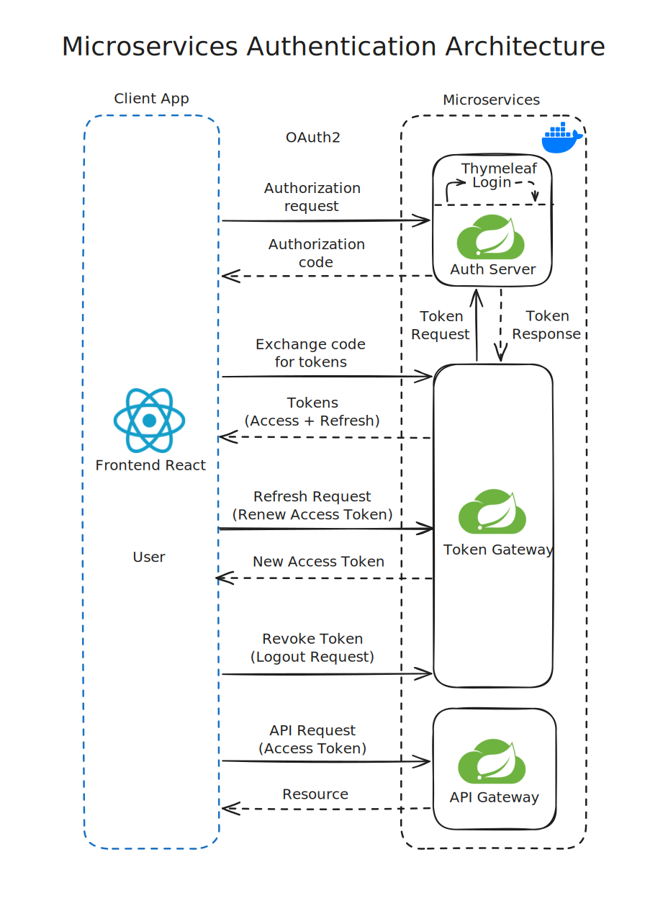

# 🌐 ForoHub - [Token Gateway]


## 📚 Índice

1. [📝 Descripción](#-descripción)
2. [✨ Características principales](#-características-principales)
3. [💻 Tecnologías principales](#-tecnologías-principales)
4. [📦 Dependencias](#-dependencias)
5. [🔧 Requisitos del proyecto](#-requisitos-del-proyecto)
6. [🧩 Variables de Entorno](#-variables-de-entorno)
7. [🧱 Flujo de Autenticación y Gestión de Tokens](#-flujo-de-autenticación-y-gestión-de-tokens)
8. [🔒 Seguridad y Acceso a Endpoints](#-seguridad-y-acceso-a-endpoints)
9. [🔗 Endpoints Principales](#-endpoints-principales)
10. [👨‍💻 Autor](#-autor)

## 📝 Descripción

El **Token Gateway** es un microservicio que actúa como **intermediario seguro** entre el **frontend** y el **Auth Server**. Su principal objetivo es:

- Gestionar el intercambio de **authorization codes** por **access tokens** y **refresh tokens**.
- Renovar tokens expirados usando cookies **HttpOnly**.
- Manejar el **logout** y revocación de tokens.
- Proteger los endpoints del frontend y evitar que accedan directamente al Auth Server.


## ✨ Características principales

- 🔁 Intercambio de **authorization_code → access_token + refresh_token**.
- 🔄 Renovación de access tokens mediante refresh token almacenado en cookie HttpOnly.
- 🚪 Logout seguro que elimina la cookie de refresh token.
- 🌐 Integración con **Auth Server** usando **OAuth2** y **Feign Client**.
- 🌍 CORS configurado para permitir únicamente solicitudes desde el frontend autorizado.
- 🔒 Endpoints expuestos únicamente para operaciones de tokens; todas las demás rutas están denegadas.

## 💻 Tecnologías principales

- **Spring Boot**: Desarrollo ágil de microservicios en Java.
- **Spring Security**: Configuración de seguridad y protección de endpoints.
- **Feign Client**: Comunicación declarativa con Auth Server.
- **JWT**: Manejo de access tokens para autenticación.
- **Cookies HttpOnly**: Almacenamiento seguro de refresh tokens.
- **Spring Cloud & Eureka**: Registro y descubrimiento de microservicios.
- **API REST**: Interfaz para el frontend.


## 📦 Dependencias

- **Spring Boot Starter Web**: Servidor REST.
- **Spring Boot Starter Security**: Seguridad y protección de endpoints.
- **Spring Cloud OpenFeign**: Comunicación con Auth Server.
- **Spring Boot Starter Actuator**: Monitoreo y métricas.
- **Lombok**: Reducción de código repetitivo.
- **Swagger/OpenAPI**: Documentación automática de endpoints.

## 🔧 Requisitos del proyecto

- **JDK 21** o superior.
- **Maven** para la gestión de dependencias.
- **IntelliJ IDEA** o cualquier IDE compatible con Java.

## 🧩 Variables de Entorno

Estas variables son necesarias para el correcto funcionamiento del microservicio.

```dotenv
# 🏗️ Infraestructura y servicios
EUREKA_URL=your_eureka_server_url
CONFIG_SERVER_HOST=your_config_server_url
SPRING_PROFILES_ACTIVE=default

# 🌍 Frontend y OAuth2
APP_FRONTEND_URL=http://localhost:5173
AUTH_SERVER_CLIENT_ID=your_client_id
AUTH_SERVER_CLIENT_SECRET=your_client_secret
```

> Reemplaza los valores de ejemplo con los detalles de tu configuración real.

## 🧱 Flujo de Autenticación y Gestión de Tokens

El **Token Gateway** actúa como intermediario entre el **frontend** y el **Auth Server**, gestionando el ciclo completo de autenticación y renovación de tokens de forma segura.

A continuación se muestra el flujo general del proceso **OAuth2 Authorization Code Flow** utilizado en **ForoHub**:



**Descripción del flujo:**

1. 🧑‍💻 El usuario hace clic en **Login** desde el frontend React.
2. 🔄 El frontend redirige al **Auth Server (Thymeleaf)** para ingresar credenciales.
3. ✅ El **Auth Server** valida al usuario con `user-service` y genera un **authorization_code**.
4. 🚀 El **Auth Server** redirige al frontend con dicho código.
5. 📩 El frontend envía el **authorization_code** al **Token Gateway** (`/token/exchange`).
6. 🔑 El **Token Gateway** solicita al **Auth Server** los tokens (**access_token** y **refresh_token**).
7. 📦 El **access_token** se devuelve al frontend para acceder a los microservicios.
8. 🍪 El **refresh_token** se almacena en una **cookie HttpOnly**.
9. ♻️ Cuando el token expira, el frontend solicita uno nuevo mediante `/token/refresh`.
10. 🚪 El **logout** elimina la cookie y finaliza la sesión de manera segura.

> Este flujo garantiza una autenticación centralizada y una gestión de tokens segura entre el frontend, el Token Gateway y el Auth Server.


## 🔒 Seguridad y Acceso a Endpoints

- CORS configurado para permitir únicamente solicitudes desde el **frontend autorizado**.
- Los endpoints aceptan únicamente **POST** y están protegidos para evitar accesos no autorizados.
- Renovación de tokens y logout se gestionan de forma segura mediante cookies **HttpOnly**.
- No se persisten datos de tokens; toda la información se obtiene del Auth Server bajo demanda.


## 🔗 Endpoints Principales

| Endpoint             | Método | Descripción                                                                                   |
|---------------------|--------|-----------------------------------------------------------------------------------------------|
| `/token/exchange`    | POST   | Intercambia el `authorization_code` recibido desde el frontend por **access_token** y **refresh_token**. |
| `/token/refresh`     | POST   | Genera un nuevo **access_token** usando el **refresh_token** almacenado en cookie HttpOnly.   |
| `/token/logout`      | POST   | Elimina la cookie que contiene el **refresh_token**, cerrando la sesión de manera segura.     |

> Todos los endpoints están protegidos y solo deben ser accesibles desde el frontend autorizado. El Token Gateway actúa como intermediario seguro entre el frontend y el Auth Server.


## 👨‍💻 Autor

**William Medina**  
Autor y desarrollador de **ForoHub - [Token Gateway]**. Puedes encontrarme en [GitHub](https://github.com/william-medina)
